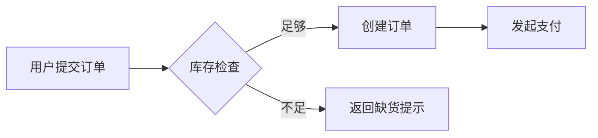

# 业务逻辑

> 最后更新：（待填写）

## 业务概述

（待补充：两三句话说清这个系统给谁解决什么问题。）

## 领域模型与术语表

| 术语 | 含义 | 对应代码/表 |
|------|------|-------------|
| （待补充） | | |

> 统一术语很重要：代码、文档、沟通中同一个概念只用一个词。

## 核心业务流程

> 语法参考：[Mermaid flowchart](https://mermaid.js.org/syntax/flowchart.html)（方向关键字、节点形状、带标签边的写法见该页）。

每个核心流程一张图加一段文字说明：

### （示例）下单流程

（待补充：流程中的关键规则、异常分支、涉及的模块。）

## 业务规则清单

把散落在代码里的"魔法规则"集中记录：

| 规则 | 内容 | 实现位置 |
|------|------|----------|
| （示例）订单超时 | 30 分钟未支付自动取消 | `services/order.py` |
| （待补充） | | |
