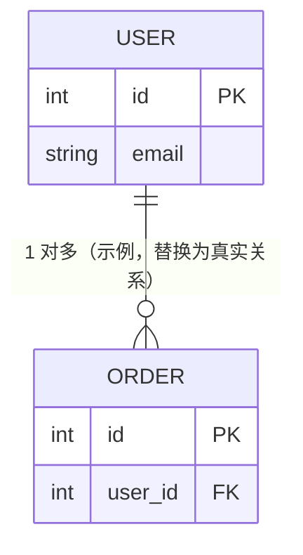

# 数据库架构

> 最后更新：（待填写）

## 概览

- **数据库类型/版本**：（待补充）
- **ORM / 迁移工具**：（待补充，如 Prisma / Alembic / Flyway）
- **连接配置来源**：（待补充，指向 project-config.md 中的环境变量）

## ER 图

> 语法参考：[Mermaid erDiagram](https://mermaid.js.org/syntax/entityRelationshipDiagram.html)（基数符号、属性与 PK/FK/UK 键的写法见该页）。

## 表结构

每张表按以下结构记录：

### （示例）users

（一句话说明这张表存什么）

| 字段 | 类型 | 约束 | 说明 |
|------|------|------|------|
| id | int | PK, 自增 | 主键 |
| email | varchar(255) | UNIQUE, NOT NULL | 登录邮箱 |
| created_at | timestamp | DEFAULT now() | 创建时间 |

## 索引策略

| 表 | 索引 | 字段 | 类型 | 目的 |
|----|------|------|------|------|
| （待补充） | | | | |

> ⏳ 待补充：索引应对应真实慢查询/高频查询场景，不要照抄主键。

## 迁移管理

- 迁移文件位置：（待补充）
- 新建迁移命令：（待补充）
- 执行迁移命令：（待补充）
